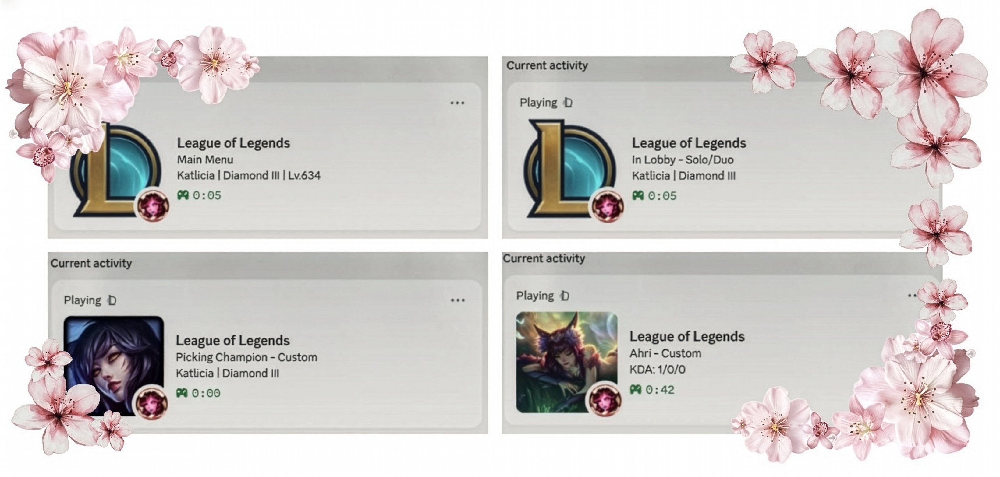
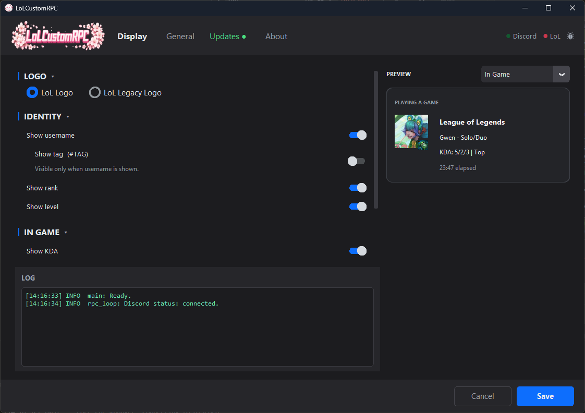

<p align="center">
  
</p>

<h1 align="center">LoLCustomRPC</h1>

<p align="center">
  Custom Discord Rich Presence for League of Legends
</p>

<p align="center">
  
  
  
  
</p>

---

## What is it?

LoLCustomRPC is a fully customizable Discord Rich Presence client that shows your live League of Legends status — including your champion, skin, KDA, rank, role, queue type, and more. It runs seamlessly in the background as a system tray icon and updates your profile automatically.

<p align="center">
  
</p>

## Features

- Live game status — champion, KDA, role, queue type, game mode
- Lobby & champion select detection
- Rank display (Iron -> Challenger) with localized tier names
- Summoner name, tag, and level display
- 16 language support with official LoL localizations
- Auto-update
- Minimal system tray footprint
- Start with Windows option

## App Preview

<p align="center">
  
</p>

## Installation

1. Download the latest `LoLCustomRPC.exe` from [Releases](https://github.com/Katlicia/LOLCustomRPC/releases/latest)
2. Run the exe — no installation needed
3. Open League of Legends
4. Discord will show your status automatically

### ⚠️ Note on Windows SmartScreen / Antivirus Warnings

When running the `.exe` for the first time, Windows Defender or your antivirus might flag the application as a virus or an "unrecognized app". 

**Why does this happen?**
This is a very common "false positive" for standalone applications. Because this is a free, hobby project, it does not have an expensive Publisher Certificate (Code Signing), which makes Windows overly cautious.

**Is it safe?**
Yes. The project is 100% open-source. You can inspect every line of code here on GitHub, or simply [build it yourself from the source code](#building-from-source) if you prefer not to use the pre-compiled executable. 

**How to run it:**
If Windows SmartScreen blocks the app, click **"More info"** and then **"Run anyway"**.

## Settings

Open the settings window to customize:

- **Display** — toggle nick, tag, rank, level, KDA, role; choose logo
- **General** — start with Windows, start minimized, auto update
- **Updates** — check for updates manually, view release notes

## Building from Source

**Requirements:** Python 3.10+

Don't forget to create .env file (check .env.example)
```bash
git clone https://github.com/Katlicia/LOLCustomRPC.git
cd LOLCustomRPC
pip install -r requirements.txt
python main.py
```

**Build exe:**

```bash
pip install pyinstaller
pyinstaller LoLCustomRPC.spec
```

The output will be at `dist/LoLCustomRPC.exe`.

## Reporting a Bug

Click the bug icon in the top-right corner of the app, or open an issue directly at [GitHub Issues](https://github.com/Katlicia/LOLCustomRPC/issues/new).

## License

[MIT](LICENSE)
